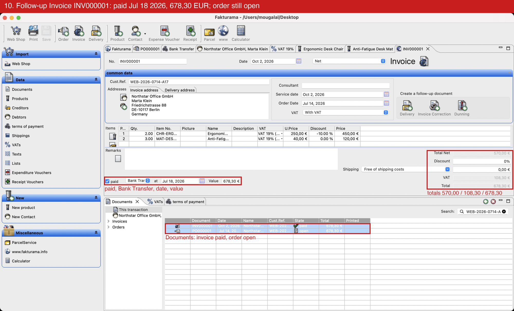

# Fakturama Image-to-Cash

Turns a single order image into a saved, verified Order and linked Invoice in Fakturama.
Windows with Microsoft UI Automation is the main path, as the brief requires; the same flow also
runs on macOS through its Accessibility API. Design: [docs/DESIGN.md](docs/DESIGN.md).

## Status

- **Stage 1 (extract): done.**
  - The output is `order.json`, or `review.json` when anything can't be confirmed.
  - A vision model reads the image through OpenRouter. OCR (Windows OCR, or macOS Vision on a
    Mac) then confirms every critical field, and exact decimal arithmetic checks the totals.
  - Run log: [docs/extraction-run-notes.md](docs/extraction-run-notes.md).
- **Stage 2 on Windows (UI Automation): green end to end.** `image-to-cash drive order.json` runs
  the brief's Order-first flow: Order, Debtor (select or create, with its payment method),
  Products (select or create, with their VAT), save, the linked Invoice, the paid status, and
  verification in Data > Documents. In a Windows 11 ARM VM (Parallels) on this Mac, on the
  `order.json` of the clean sample: Order PO000002 and Invoice INV000002 saved, the Invoice paid,
  both verified in Data > Documents, in about 1.5 minutes. Earlier runs on the same database
  covered the create paths: payment method, Debtor with a separate delivery address, and both
  Products. See [Stage 2 on Windows](#stage-2-on-windows).
  - **At 100 % scaling** (the same VM, set to "Scaled"): a new Debtor, two new Products, Order
    PO000007 and Invoice INV000006, saved and verified. Three fixes came out of it: a wider
    label-to-field gap (the gross price field sits 22 points off its column), the Documents tree
    enlarged before OCR (Windows OCR missed "Orders" at that size), and the toolbar's Contact
    button as a fallback (after Fakturama restarted, the left panel's New Contact opened a saved
    Debtor). The run stopped once on each; after each fix, `discard` and a re-run. The last run
    found the saved Order and resumed at the Invoice.
  - **At 150 %** (1920 × 1200, so 1280 × 800 points): a new Debtor and two new Products, then
    Order PO000008 and Invoice INV000007, paid and verified, in about 2 minutes. Fixes on the way:
    the Documents list is found between its search row and its bottom edge (on a smaller screen
    the whole view was 80 points tall), a category scrolled out of a short tree is selected by
    typing its name, and an icon belongs to the label it starts under (the address icons start
    47 points into "Addresses", so the Product picker had been clicked). A screen below about
    1280 × 720 points leaves the Order editor too short: the bot stops, as it does not scroll
    editors.
- **Also checked live on Windows:** a re-run of an entered order stops as already entered; a
  near-duplicate Debtor ("Northstar Office GmbH & Co") and Product (`CHR-ERG-010`) are created
  beside the originals and the exact rows are picked; a reused VAT rate is opened and its code S
  confirmed; a near-miss contact ("Kline" for "Klein") stops for review.
  - **Resume at the Invoice:** order E05 named a payment method Fakturama lacked ("Credit Card")
    for an existing Debtor. The old flow saved Order PO000005, then stopped at the Invoice. After
    the fix, the re-run found PO000005, reopened it, created "Credit Card" and saved Invoice
    INV000004 paid.
  - **Discard:** a stopped New Order, and a stopped Invoice beside its saved Order, were closed
    with nothing saved: "Save Parts" was unticked and read back before OK.
  - **Batch from the image:** a copy of the sample with reference B17 went unattended from the
    image to Order PO000006 and Invoice INV000005, paid and verified (fixture reader, Windows
    OCR). Windows OCR misses the item table's short percent cells; exact sums confirm them (see
    [How it decides](#how-it-decides)). The clean A17 sample also passed extraction, then stopped
    in Fakturama, because the VM's test database holds five documents with that reference.
- **Stage 2 on macOS: done**, the same flow through the macOS Accessibility API. Findings:
  [docs/spike-macos-ax.md](docs/spike-macos-ax.md).
  Re-run green after the later changes (resume check, Documents categories, measured rows): a live
  extraction of the clean image, then Order PO000002 and Invoice INV000002 in about 2.5 minutes.
  - **Batch on the Mac** (OpenRouter reader, macOS Vision). The clean sample was found already
    entered (PO000001 and INV000001) and counted as done without a second entry. A copy of it
    with the reference changed to B17 was read and entered as Order PO000003 and Invoice
    INV000003, paid and verified, in about 2 minutes. The pixelated copy went to `review/`
    untouched, because OpenRouter answered "no credit" (HTTP 402) that time.
  - **Discard on the Mac** closed ten saved editors in 12 seconds.
  - **Re-checked after the Windows scaling fixes:** a new Debtor and two new Products, then
    Order PO000004 and Invoice INV000004, paid and verified, in about 2.5 minutes. One fix: an
    address tab is read once a fresh scan shows it selected (a fixed half second had been too short
    while the tabs redrew).

## Setup and run on Windows

Tested on Windows 11 (ARM, in a Parallels VM) at 100 %, 150 % and 200 % display scaling.

1. Install Fakturama 2.2 for Windows and create its workspace. Set *Settings… > General >
   Currency locale* = **Germany**, then quit and restart Fakturama once: the preference file the
   bot checks is written on quit.
2. Install [Git for Windows](https://git-scm.com/download/win) and
   [uv](https://docs.astral.sh/uv/getting-started/installation/).
3. In PowerShell:

   ```powershell
   git clone https://github.com/MostafaGalal1/fakturama-image-to-cash.git
   cd fakturama-image-to-cash
   uv sync
   uv run pytest -q
   ```

4. For the live reader, put an [OpenRouter](https://openrouter.ai) API key in a git-ignored
   `.env`. This prompts for it without echoing:

   ```powershell
   $key = Read-Host "OpenRouter key" -AsSecureString
   "OPENROUTER_API_KEY=$([Net.NetworkCredential]::new('', $key).Password)" | Set-Content -Encoding ascii .env
   ```

5. Start Fakturama, leave it on its start page and keep your hands off the PC while the bot runs:
   it sends a click or key only while Fakturama has the foreground window and the keyboard focus.

   ```powershell
   uv run --env-file .env image-to-cash extract samples\sales-order-input-clean.png --reader openrouter --out out\clean
   uv run image-to-cash drive out\clean\order.json --out out\drive
   ```

   Or a whole folder of images, unattended: `uv run --env-file .env image-to-cash batch inbox`
   (see [Unattended](#unattended-a-folder-of-orders)).

Exit codes, outputs and review work as described under [Usage](#usage) and
[Stage 2](#stage-2-enter-the-order-into-fakturama). How the Windows backend works, and what the
live runs taught: [Stage 2 on Windows](#stage-2-on-windows).

## Setup on macOS

```bash
uv sync
uv run pytest -q
```

The live reader needs an [OpenRouter](https://openrouter.ai) API key in a git-ignored `.env`. This
command prompts for the key without echoing it:

```bash
(umask 077; read -rs "k?OpenRouter key: " && print -r -- "OPENROUTER_API_KEY=$k" > .env && echo)
```

## Usage

Read the original sample image with the live reader:

```bash
uv run --env-file .env image-to-cash extract samples/sales-order-input-clean.png \
  --reader openrouter --out out/clean
```

- `--model` picks another OpenRouter model. The default is `anthropic/claude-sonnet-5.5`, which
  costs about 1–2 cents per order.
- Requests ask OpenRouter to use only providers that don't collect prompt data.
- `--reader fixture --fixture tests/fixtures/sample_order.json` replays a recorded response
  instead, with no key and no network.

Exit codes:

| Code | Meaning |
|---|---|
| `0` | `order.json` written |
| `1` | error |
| `2` | bad command-line usage |
| `3` | needs review (see `review.json`) |

`extract` clears `order.json` and `review.json` from the `--out` folder first, so a failed run
never leaves an old order behind for Stage 2.

### When a run needs review

The pixelated copy embedded in the brief always needs review, because OCR can confirm only 7 of
its 41 fields (the clean original confirms all 41):

```bash
uv run image-to-cash extract samples/sales-order-input.png \
  --fixture tests/fixtures/sample_order.json --out out/review-demo
```

1. Check **every** field of `draft_order` in `out/review-demo/review.json` against the image;
   `mismatches` lists the fields OCR could not confirm.
2. Correct the draft where needed. Write a contact with a multi-word first name as
   `Last, First Names` (for example `Klein, Anna Maria`); otherwise it goes back to review.
3. Approve it:

```bash
uv run image-to-cash approve out/review-demo/review.json --out out/review-demo
```

**One unconfirmed field gets a second look first** (design §4): the reader re-reads just that
field from a 3× crop around the OCR text most like it, and OCR reads the crop too. The field is
corrected only when both agree and no other field already claims that print; `review.json`
records the attempt under `zoomed_retry`.

`approve` re-runs every arithmetic and business check before it writes `order.json`. It skips the
OCR cross-check, because a person has vouched for the values. An `order.json` next to a
`review.json` therefore means a person approved it. Only approve values you can actually read: a
best guess goes into Fakturama as if it were checked (see the run notes, section 2).

## Stage 2: enter the order into Fakturama

### One-time setup (macOS)

1. Install Fakturama 2.2 and create its workspace (the bot was developed against
   `~/Desktop/Database`, the default when the workspace is the Desktop).
2. In Fakturama: *Settings… > General > Currency locale* = **Germany** (EUR). The bot checks this
   preference and stops if the currency is not the euro.
3. Give the terminal (or IDE) that runs the bot two permissions in *System Settings > Privacy &
   Security*: **Accessibility** (to read and drive Fakturama) and **Screen Recording** (for the
   screenshots and the OCR check that a grid has rows).
4. Back up the database folder before a run you may want to undo, for example
   `cp -R ~/Desktop/Database ~/Desktop/Database.backup` with Fakturama closed. Fakturama keeps its
   preferences in the database too, so restoring an older copy also restores its currency locale:
   set it to Germany again if the bot stops with `fakturama_currency_not_eur`.

### Run (macOS)

Start Fakturama, leave it on its start page, then leave the Mac alone while the bot runs (about
10 minutes; it refuses to send any click or keystroke unless Fakturama has the keyboard focus and
the front window, so using the Mac makes it stop, never type elsewhere):

```bash
uv run image-to-cash drive out/clean/order.json --out out/drive
```

| Code | Meaning |
|---|---|
| `0` | Order and linked Invoice saved and verified |
| `1` | error (the accessibility API failed; see `run.jsonl`) |
| `3` | stopped for review: the reason is printed and logged, nothing was guessed |

The run writes `out/drive/run.jsonl` (one line per step: what was found, created, checked) and
`out/drive/screens/` (numbered screenshots of Fakturama's own window at each milestone). After a
stop, unsaved editors are left open for a person to look at; `image-to-cash discard` then closes
them without saving (see [Unattended](#unattended-a-folder-of-orders)).

### A complete run

`out/drive/run.jsonl` from the run on an empty database (2026-10-02, 4 minutes):

```text
order_opened     done     PO000001
payment_method   created  Bank Transfer (code Credit transfer)
debtor           created  Northstar Office GmbH (separate delivery address)
debtor_selected  checked
vat              created  VAT 19%
product          created  CHR-ERG-01      line 1 checked
vat              found    VAT 19%
product          created  MAT-DESK-02     line 2 checked
order_saved      done     PO000001        listed as open
invoice_saved    done     INV000001       listed as paid
```

Annotated screenshots of that run, in order:
[order header](docs/screenshots/01-order-header.png),
[payment method](docs/screenshots/02-payment-method-filled.png),
[debtor addresses](docs/screenshots/03-debtor-addresses.png),
[debtor miscellaneous](docs/screenshots/04-debtor-miscellaneous.png),
[debtor reselected](docs/screenshots/05-debtor-selector.png),
[VAT 19%](docs/screenshots/07-vat-filled.png),
[product](docs/screenshots/08-product-CHR-ERG-01.png),
[order lines and totals](docs/screenshots/10-order-complete.png),
[order in Documents](docs/screenshots/11-documents-order.png),
[paid invoice and Documents](docs/screenshots/13-documents-final.png).



### How it decides

- **Reuse or create.** The Debtor is reused only when one row matches Company, First Name, Name,
  ZIP and City exactly; a product only by exact SKU with the same name, gross price and VAT; a VAT
  rate only when `VAT <p>%` has value p; a payment method only with zero discount and days. None
  means create; two, a near miss (≤ 2 characters off) or a conflicting definition stop the run.
- **A percent cell OCR cannot see** (Windows OCR skips short cells such as "10%") counts as
  confirmed only when it is the one unknown in one of the brief's own sums: the line price
  (§3.16) for a discount, the VAT total (§4.3) for a VAT rate. Every other value in that sum must
  be confirmed by OCR, and no other percentage to the hundredth may give the same cents. A reading
  is confirmed, never corrected. Two unseen VAT rates still go to review: swapped rates on lines
  with equal nets give the same VAT total.
- **Every write is read back**: text fields, pop-ups, dates, amounts (typed with a decimal comma,
  as the German currency locale expects), each order line, the totals, and both rows in
  Data > Documents.
- **Grids are read through the clipboard** (saved and restored around each copy), never by OCR;
  OCR only confirms a grid has a first row, because copying an empty grid crashes Fakturama.

## Stage 2 on Windows

The flow is the same code. Only the backend changes:

- **UI Automation** (the `uiautomation` package) reads the controls.
- **Win32 through ctypes** does the rest:
  - menus run by command id (`WM_COMMAND`), without opening;
  - native buttons are pressed with `BM_CLICK`;
  - clicks and keys go through `SendInput`;
  - the clipboard is saved and restored around each grid copy;
  - screenshots come from `PrintWindow` of Fakturama's own window.
- **Windows OCR** (`Windows.Media.Ocr`) is local and needs no account.

Code: `src/image_to_cash/drive/backend/windows_uia.py`, `win32_api.py`, `uia_roles.py`,
`src/image_to_cash/ocr/windows_ocr.py`.

The safety rule is the macOS one. A click or keystroke is sent only while Fakturama owns the
foreground window and the keyboard focus, so Windows also needs Fakturama in front while it types.
To keep a person's own desktop free, run the bot in a VM or a separate Windows session.

### Test it from a Mac (Apple silicon)

1. **Make a Windows 11 ARM VM.** Use Parallels Desktop (its wizard downloads Windows), VMware
   Fusion, or UTM (free; it needs Microsoft's Windows 11 ARM64 ISO). Give it at least 4 GB of RAM.
   In Windows, set screen and sleep to *Never* (*Settings > System > Power*): a locked screen
   blocks input.
2. **Install in the VM:**
   - Fakturama 2.2 for Windows. It is x64 and runs under Windows' built-in emulation. Create its
     workspace and set *Settings… > General > Currency locale* = **Germany**. Quit and restart it
     once, because the preference file the bot checks is written on quit.
   - [Git for Windows](https://git-scm.com/download/win).
   - [uv](https://docs.astral.sh/uv/getting-started/installation/): run
     `powershell -ExecutionPolicy ByPass -c "irm https://astral.sh/uv/install.ps1 | iex"`.

   Every compiled dependency has a native Windows ARM64 wheel.
3. **Copy the code and an order in.** On the Mac, bundle the repository:

   ```bash
   git bundle create ~/Desktop/fakturama-image-to-cash.bundle --all
   ```

   Copy that file and `out/clean-live/order.json` into the VM through its shared folder. Leave
   `.env` behind: `drive` does not use the OpenRouter key. Then, in PowerShell in the VM:

   ```powershell
   git clone fakturama-image-to-cash.bundle fakturama-image-to-cash
   cd fakturama-image-to-cash
   uv sync
   uv run pytest -q
   ```

   The unit tests pass, and the macOS-only tests skip.
4. **Run the live contract test.** Open Fakturama on its start page, then keep your hands off the
   VM:

   ```powershell
   $env:FAKTURAMA_LIVE = "1"
   uv run pytest tests/test_windows_uia_contract.py -s -v
   ```

   It does five things:
   - lists the main window;
   - finds the editor and list folders;
   - finds the two toolbar buttons the flow presses, by tooltip;
   - types into a New VAT editor and reads the text back, then picks a pop-up option and
     captures the window;
   - prints a calibration report: tab folders, buttons with their tooltips, and the grid panes.

   Compare the report with `WINDOWS_LAYOUT` in `src/image_to_cash/drive/layout.py` and fix the
   values that differ. The test closes every editor it opens without saving.
5. **Do a full run**, with Fakturama on its start page and hands off the VM:

   ```powershell
   uv run image-to-cash drive order.json --out out\drive
   ```

   The exit codes and outputs (`run.jsonl`, `screens\`) are the macOS ones. You can use the Mac's
   other apps while it runs, as long as you don't click into the VM. Make sure the VM is not set to
   pause in the background.

### What the live Windows runs taught

Fixed in the code:

- **Tooltips:** fields, pop-ups and icons show no tooltips to UI Automation; toolbar buttons
  carry theirs as their name. `drive/fakturama/controls.py` finds each control by tooltip, else
  by its label, its values or its place (a section's first icon).
- **Labels:** a label is only as wide as its text, so a field's distance is measured from the
  label column's right edge.
- **Hidden controls:** SWT's tab folders and links claim to be offscreen while shown, so hiding is
  read from window visibility. Tab headers report their frames in points at high DPI.
- **Clipboard deadlock:** the clipboard's owner window must answer messages. It runs on its own
  thread; otherwise Fakturama's copy (and Parallels' clipboard sync) waited on it with the
  clipboard locked.
- **Start of a run:** the bot keeps the display on, wakes it, and minimizes its own terminal,
  which otherwise covered Fakturama.
- **"Save Parts":** its parts are rows of a native list view whose ticks UI Automation does not
  report. The adapter reads each tick from the list itself (`LVM_GETITEMSTATE`) and clicks the box
  drawn left of the row's text; OK is pressed only after the one part reads back unticked.
- **Error log:** after an internal error Fakturama opens its Error view below the left panel, a
  third tab folder. The editor and list folders are the two that share the widest column.
- **Row pitch:** the order grid's frame reaches into the totals beside it, so "Total Net" read as
  a third row and the median gap put row 2 eighteen points low (an empty copy, then Fakturama's
  internal error). Rows never lie closer than one pitch, so the pitch is the smallest plausible gap.
- **Tabs:** UI Automation hit-tests a tab folder, not the windowless tab in it, so the click
  guard accepts the folder that draws the tab.
- **Focus:** right after a dialog closes itself, UI Automation names pid 0 (the desktop) as the
  focus owner. That counts as no answer; the front-window check still decides.
- **Self-closing selector:** the Debtor selector can accept its single hit by itself while the
  bot copies its grid. Keys now refuse once the clicked control has gone (they had reached the
  Order's price-mode box), and a selector that closed by itself counts as picked; the addresses
  then decide.
- **Double clicks:** two single clicks on the same grid row within Windows' double-click time
  made a double click, which accepted the row. A single click now waits that time out.
- **Role window:** the "address type" ▶ reopens its window on Windows, so Escape closes it.
- **Save:** Eclipse saves the active part, and the Documents search left that list active, so
  Save on the Invoice did nothing. Save now clicks the open editor's tab first.
- **Stops:** an unexpected stop records where it failed (`where` in `run.jsonl`).

Still open:

- **Editor height:** at 200 % scaling the editor shows about 385 points, so a Debtor's "address
  type" row is out of view. Use 100–150 % scaling, or drag Fakturama's divider between the
  editor and the lists lower (done once in the VM; Fakturama keeps it). The flow does not scroll
  editors yet.
- **Row header:** `row_header_dx` (12 points) is a guess. It works: every order line was copied
  back and checked.

## Known limitations

- The OCR cross-check ignores where a value sits: two fields that swapped values (billing and
  delivery ZIP) both pass. The zoomed second look is tried for one unconfirmed field only; two or
  more go straight to review.
- Windows OCR leaves out short, isolated table cells: the clean sample's "10%", "0%" and one
  "19%" (and the "Disc" header) were missing, also word by word. Zooming the row, cropping and
  padding single cells, and painting out the grid lines did not bring "10%" or "0%" back, so it
  is not a resolution problem. The sums confirm all three (see [How it decides](#how-it-decides)),
  so the clean sample writes `order.json` on Windows too; an image with two unseen VAT rates
  would still go to review.
- Free OpenRouter vision models misread about half the fields of the pixelated copy. The checks
  stopped them, but they are not usable as readers.
- Stage 2 has run end to end on macOS and on Windows 11 ARM in a VM at 100 %, 150 % and 200 %
  scaling. A screen below about 1280 × 720 points leaves the Order editor too short to work in
  (the flow does not scroll editors); x64 PCs have not been tried (see
  [what the live Windows runs taught](#what-the-live-windows-runs-taught)).
- A re-run never enters an order twice. Before creating anything it searches Data > Documents
  for the reference: a saved Order without its Invoice resumes at the Invoice, Order plus Invoice
  is reported as already entered, and anything else goes to a person. Master data saved before a
  stop is found and reused. Unsaved editors left by a stop are closed without saving by `discard`
  (and by `batch` after a stop for review); a dialog the bot did not open, such as Fakturama's
  "Duplicate Contact", is left to a person and ends the batch.
- Grid rows are measured by OCR in the order's lines, the selectors and the lists; a grid with
  too little text falls back to the layout's row height. Every row selection is copied back and
  compared, so a wrong value stops the run instead of picking the wrong row.

## Unattended: a folder of orders

`batch` reads and enters every order image in a folder, one after another:

```bash
uv run --env-file .env image-to-cash batch inbox/ --out out/batch
```

Each image moves to `inbox/done/` (Order and Invoice saved and verified), `inbox/review/`
(extraction needs a person; Fakturama untouched) or `inbox/stopped/` (the drive stopped).
Results land in `out/batch/<image name>/`, one line per image in `out/batch/batch.jsonl`.
`--watch 30` keeps polling the folder.

After a stop for review the batch closes the stopped order's editors without saving and goes on
with the next image:

- each editor is closed on its own, never with "Close All";
- Fakturama's "Save Parts" gets OK only once its one box reads back unticked, and a question
  naming the editor gets No;
- the bot's own selectors are cancelled.

The stopped order keeps its screenshots and `run.jsonl` for the person who reviews it, and a
re-run resumes where it stopped. Any other failure, or a discard that meets a dialog it did not
open, ends the batch. `--keep-open` ends it at the first stop instead. The exit code is 3 when
any image went to `review/` or `stopped/`.

The bot drives the real mouse and keyboard, so it needs a machine of its own: a small PC or a
virtual machine beside the pharmacist's own work. The Windows VM used here is that setup: the
Mac stayed in use while the bot worked inside the VM.

## What I would do differently

The brief asks for Fakturama's UI, so writing to its database or using its web-shop import were
out. Within that rule, one choice cost the most time:

- **macOS first.** The brief's reference platform is Windows. Building macOS first, then Windows,
  meant two backends and two sets of quirks; most Windows fixes above would have been met once.

What I would keep either way: every field and row selection read back, totals compared, and a
stop instead of a guess.

## If I had 3 more hours

In priority order, each item is about trust in an unattended run. Done since the first list:
discarding a stop's editors so a batch goes on, and measured rows in the selectors and lists.

1. **Windows on a real PC**, since the brief's reference platform is Windows. It ran green in a
   Windows 11 ARM VM at 100 %, 150 % and 200 % scaling. Next: an x64 PC, and measure
   `row_header_dx`.
2. **A recording instead of stills**, and the run report as one HTML page (steps, read-back
   values, annotated screenshots) for whoever reviews a stopped run.
